# Software Design Description

## Sequence Diagrams

The following diagrams show how the **user**, the **React application**, and the **Election Backend APIs** collaborate to implement each feature.

* `App` represents the main React root (`App.jsx`) and shared layout/navigation.
* `RequireAuth` represents the route guard (e.g., `RequireAuth.jsx`) that blocks protected routes when unauthenticated.
* `MapPage` represents the Map route/page (filters + Leaflet map).
* `DashboardPage` represents the Dashboard route/page (search table + filters + side panel + summary).
* `MapView` represents the Leaflet map component used by `MapPage`.
* `ElectionAPI` represents the backend endpoints that read from MySQL (synced from data.gov.sg).

---

| No. | User Story                             | Sequence Diagram Focus                                                                  |
| --- | -------------------------------------- | --------------------------------------------------------------------------------------- |
| 1   | Sign In and Maintain Session           | Login flow; storing session (cookie/token); session persistence after refresh           |
| 2   | Sign Out and End Session               | Logout flow; clearing session; blocking protected routes                                |
| 3   | Navigate Between Pages                 | Client-side routing between Dashboard and Map with auth gating                          |
| 4   | View Electoral Boundaries on Map       | Loading year boundaries and rendering GeoJSON polygons                                  |
| 5   | View Electoral Boundary Details on Map | Hover tooltip reads merged boundary + results summary (winner, vote share)              |
| 6   | Filter Map Results                     | Filters update visible polygons (year/type/parties/constituency)                        |
| 7   | Reset Map Filters                      | Reset restores defaults and redraws full set                                            |
| 8   | Automatic Map Focus                    | Fit bounds to selected constituency with sidebar-aware padding                          |
| 9   | Toggle Simple Map Style                | Swapping basemap tile layer without clearing overlays                                   |
| 10  | Collapse / Expand Map Filters Sidebar  | Sidebar width changes layout; map invalidation; focus padding updates                   |
| 11  | View Election Dashboard Search Table   | Fetching paged/filtered search rows for the table                                       |
| 12  | Filter Dashboard Search Results        | Filter changes trigger refetch and update counts                  |
| 13  | View Dashboard Search Result Details   | Row selection loads detail payload for charts + candidate lists in side panel           |
| 14  | Reset Dashboard Search Filters         | Reset dashboard filters; table reload; consistent side panel behaviour                  |
| 15  | View Election Dashboard Summary        | Loading summary charts + reference tables (dates/parties) with independent error states |

---

## 1. Sign In and Maintain Session

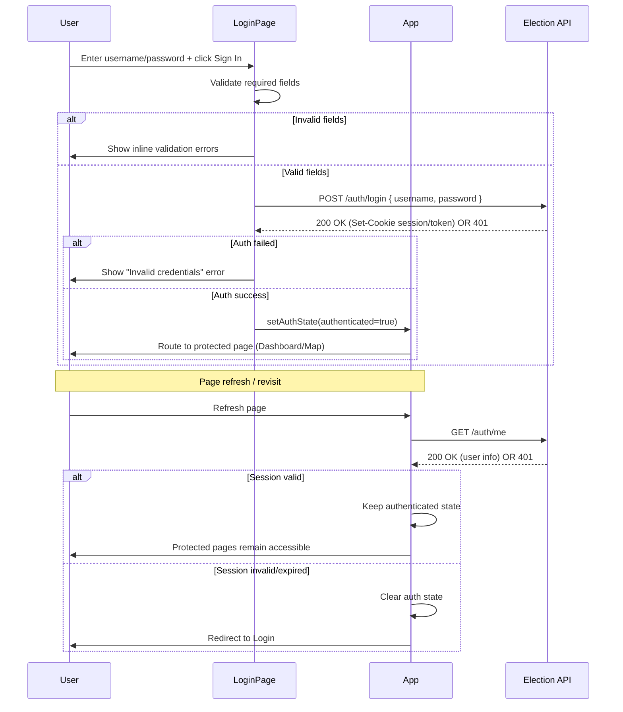

**Explanation:**
A server-issued session (cookie/token) is used so the user remains signed in across refreshes until logout/expiry.

---

## 2. Sign Out and End Session

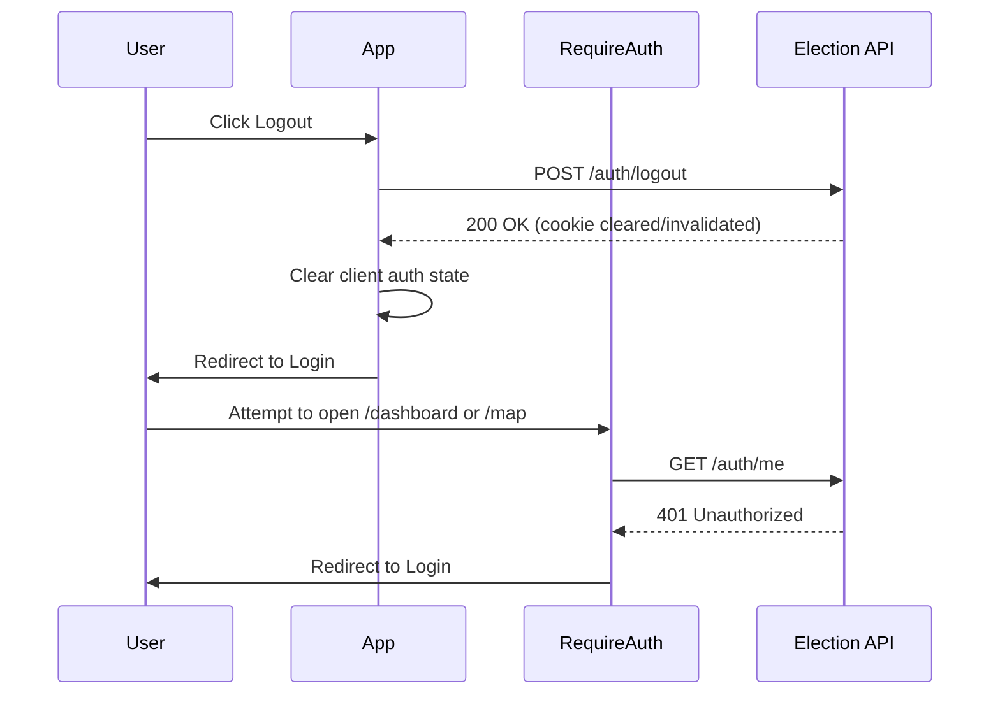

**Explanation:**
Logout clears session credentials and prevents access to protected routes.

---

## 3. Navigate Between Pages

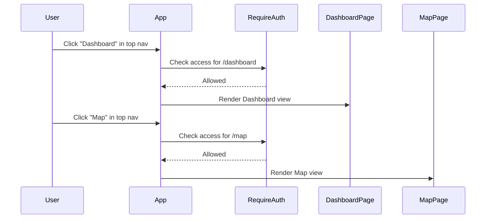

**Explanation:**
Navigation is client-side routing; auth gating is applied before protected pages render.

---

## 4. View Electoral Boundaries on Map

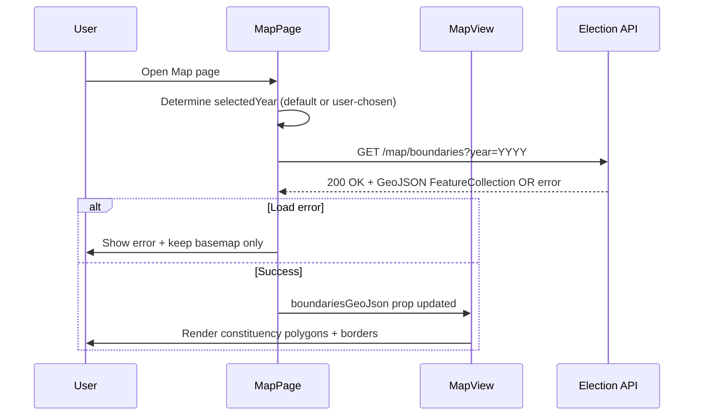

**Explanation:**
Map boundaries are fetched for the selected year and rendered as GeoJSON polygons on Leaflet.

---

## 5. View Electoral Boundary Details on Map

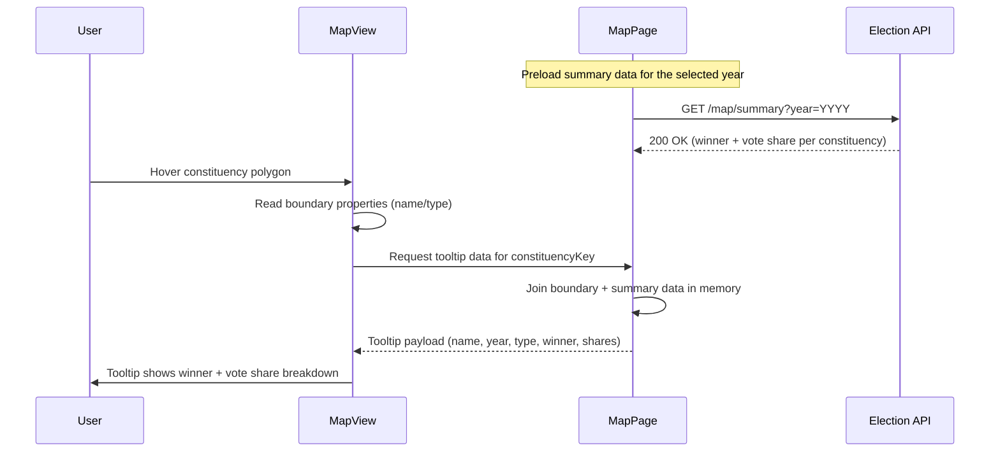

**Explanation:**
Hover tooltips are built by combining boundary metadata with year-level results summary.

---

## 6. Filter Map Results

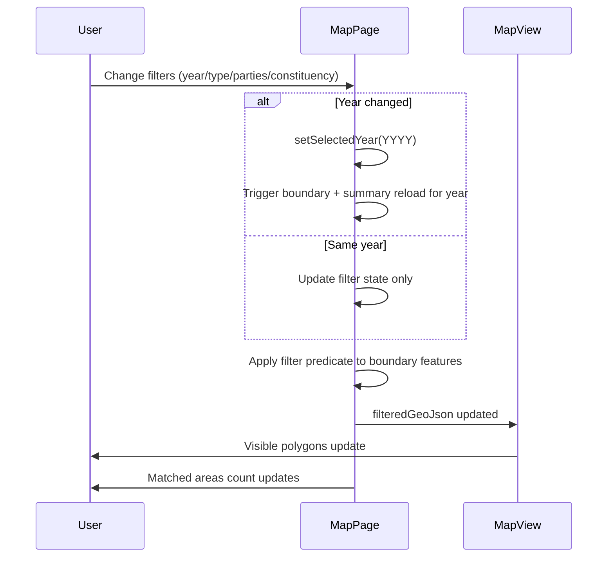

**Explanation:**
Filters update the displayed set of constituencies; a year change triggers dataset reload.

---

## 7. Reset Map Filters

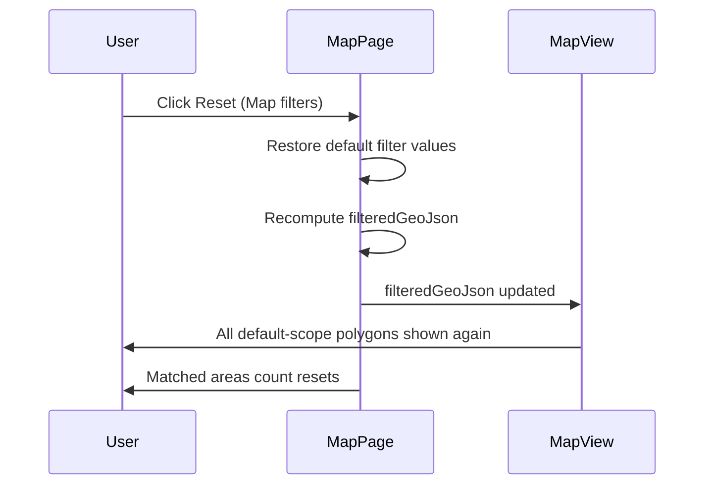

**Explanation:**
Reset restores defaults and redraws the unfiltered map scope.

---

## 8. Automatic Map Focus

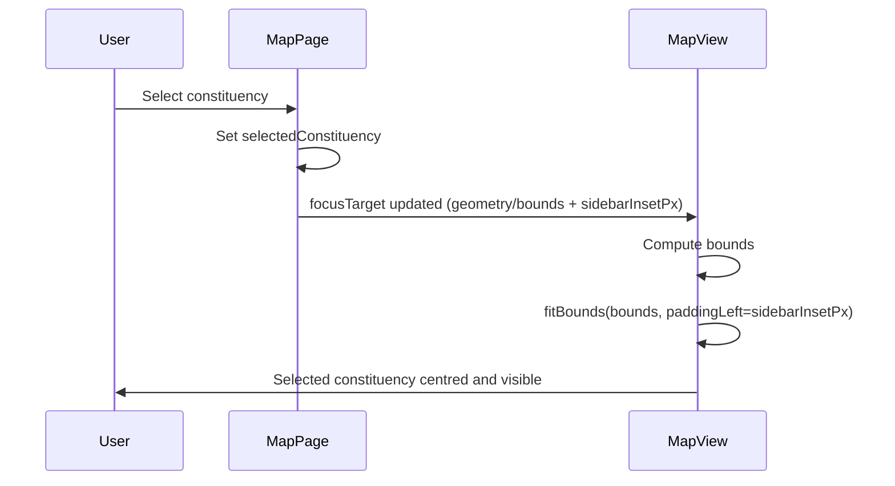

**Explanation:**
Selecting a constituency triggers `fitBounds`, using sidebar-aware padding so it does not sit under the filters panel.

---

## 9. Toggle Simple Map Style

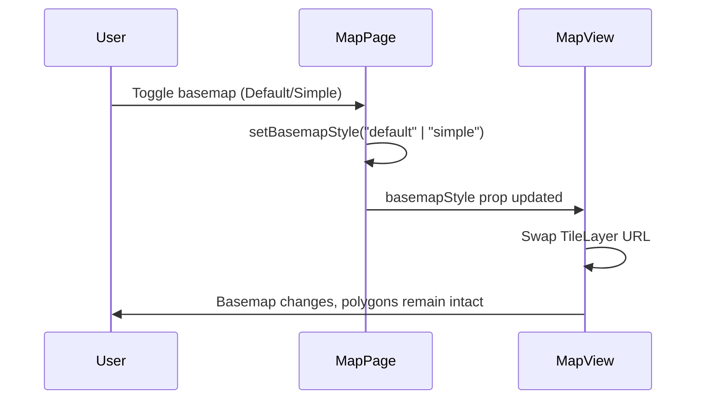

**Explanation:**
Basemap toggling swaps the tile source without clearing constituency overlays.

---

## 10. Collapse / Expand Map Filters Sidebar

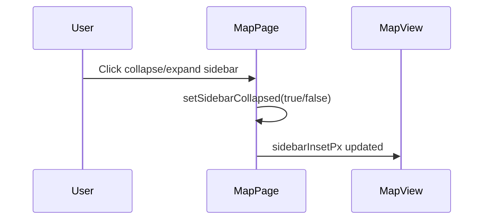

**Explanation:**
Sidebar width changes require Leaflet resize invalidation and updated focus padding.

---

## 11. View Election Dashboard Search Table

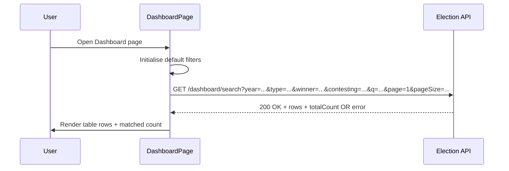

**Explanation:**
The dashboard table loads from a search endpoint (often backed by `ge_summary`) and shows count + rows.

---

## 12. Filter Dashboard Search Results

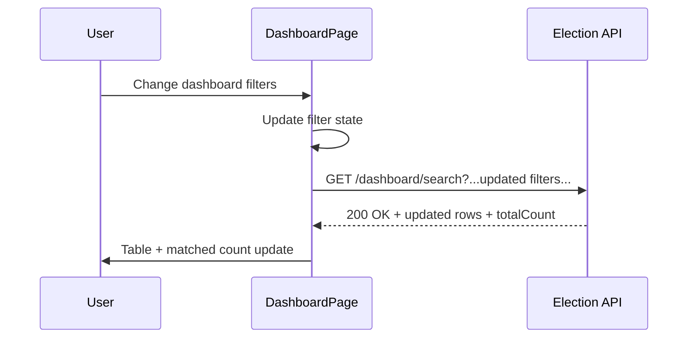

**Explanation:**
Filter changes trigger a new search query to keep the table consistent with analysis intent.

---

## 13. View Dashboard Search Result Details

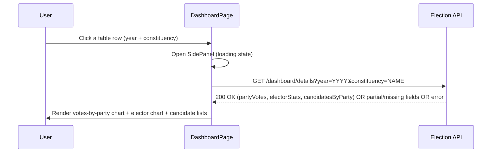

**Explanation:**
Row selection opens a details panel driven by a single consolidated details endpoint.

---

## 14. Reset Dashboard Search Filters

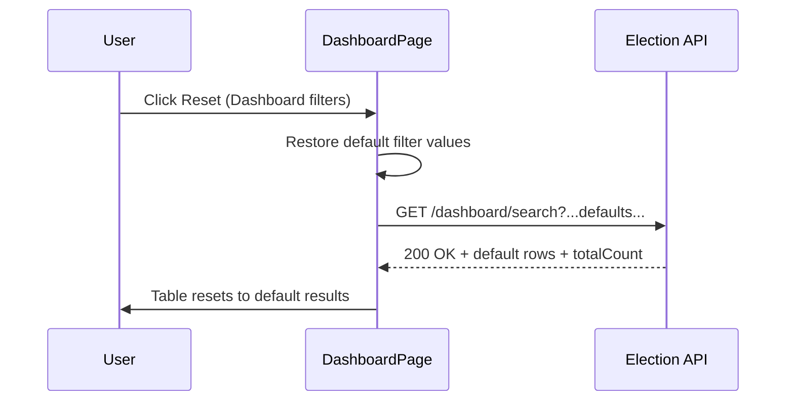

**Explanation:**
Reset reloads the default dataset view. 

---

## 15. View Election Dashboard Summary

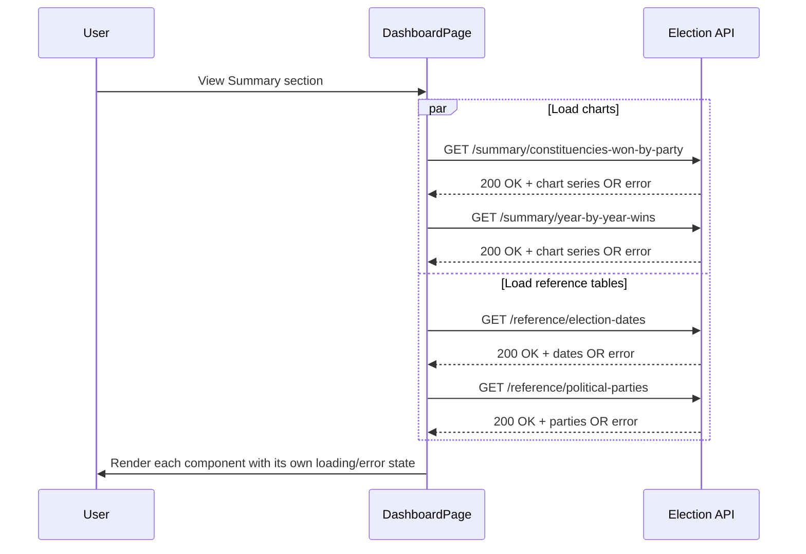

**Explanation:**
Summary charts and reference tables are best loaded independently so one failing component does not block the rest of the dashboard.

---
