# Software Design Description

## Sequence Diagrams

The following diagrams show how the **user**, the **React application**, and the **Election Backend APIs** collaborate to implement each feature.

* `App` represents the main React root (`App.jsx`) and shared layout/navigation.
* `RequireAuth` represents the route guard (e.g., `RequireAuth.jsx`) that blocks protected routes when unauthenticated.
* `MapPage` represents the Map route/page (filters + Leaflet map).
* `DashboardPage` represents the Dashboard route/page (search table + filters + side panel + summary).
* `MapView` represents the Leaflet map component used by `MapPage`.
* `ElectionAPI` represents the backend endpoints under `/api/*` that read from MySQL (synced from data.gov.sg).

---

| No. | User Story                             | Sequence Diagram Focus                                                                    |
| --- | -------------------------------------- | ----------------------------------------------------------------------------------------- |
| 1   | Sign In and Maintain Session           | Login flow; setting `token` cookie; session persistence after refresh via auth probe      |
| 2   | Sign Out and End Session               | Logout flow; clearing `token` cookie; protected routes blocked after logout               |
| 3   | Navigate Between Pages                 | Client-side routing between Dashboard and Map with auth gating                            |
| 4   | View Electoral Boundaries on Map       | Loading year boundaries via `/api/boundaries` and rendering GeoJSON polygons              |
| 5   | View Electoral Boundary Details on Map | Tooltip uses merged boundary + `/api/boundaries/summary` (winner + vote shares)           |
| 6   | Filter Map Results                     | Filters update visible polygons; year change triggers boundaries + summary reload         |
| 7   | Reset Map Filters                      | Reset restores defaults and redraws full set                                              |
| 8   | Automatic Map Focus                    | Fit bounds to selected constituency with sidebar-aware padding                            |
| 9   | Toggle Simple Map Style                | Swapping basemap tile layer without clearing overlays                                     |
| 10  | Collapse / Expand Map Filters Sidebar  | Sidebar width changes layout; map invalidation; focus padding updates                     |
| 11  | View Election Dashboard Search Table   | Bootstrapping via `/api/dashboard/options`, then loading rows via `/api/dashboard/search` |
| 12  | Filter Dashboard Search Results        | Filter changes trigger refetch from `/api/dashboard/search`                               |
| 13  | View Dashboard Search Result Details   | Row selection loads detail payload via `/api/dashboard/details`                           |
| 14  | Reset Dashboard Search Filters         | Reset filters; table reload; consistent side panel behaviour                              |
| 15  | View Election Dashboard Summary        | Summary uses `/api/dashboard/search` (unfiltered) for aggregation + `/options` for tables |

---

## 1. Sign In and Maintain Session

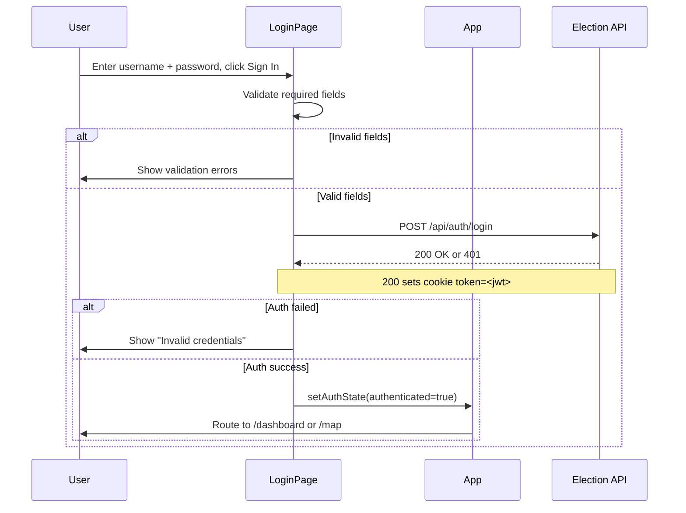

**Explanation:**
A server-issued JWT cookie (`token`) is used so the user remains signed in across refreshes until logout/expiry. Auth state can be restored by calling any protected endpoint (here, `/api/dashboard/options`).

---

## 2. Sign Out and End Session

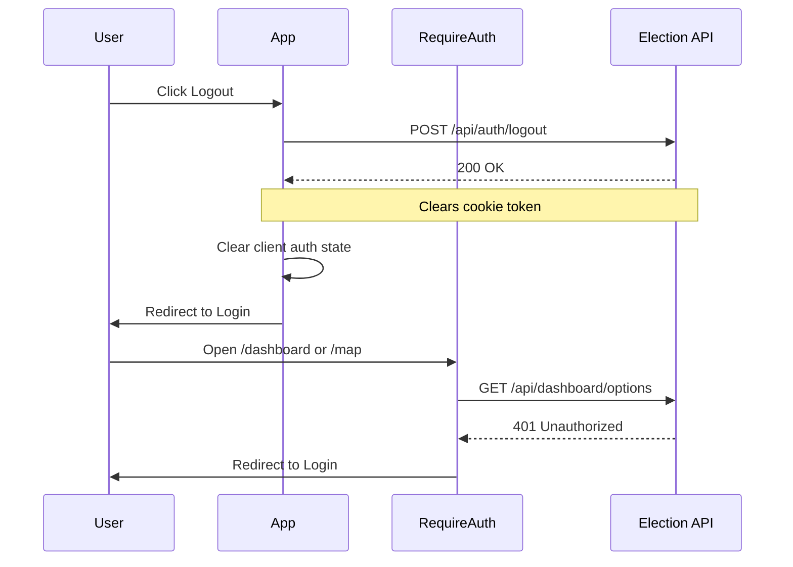

**Explanation:**
Logout clears the `token` cookie, and protected routes are blocked by re-checking authentication via a protected endpoint.

---

## 3. Navigate Between Pages

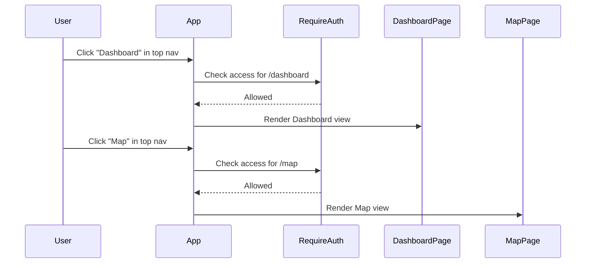

---

## 4. View Electoral Boundaries on Map

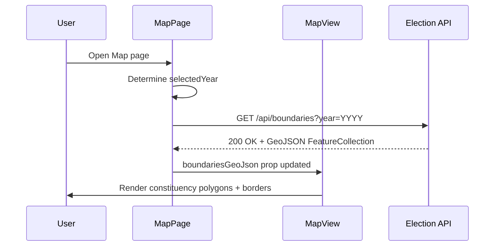

---

## 5. View Electoral Boundary Details on Map

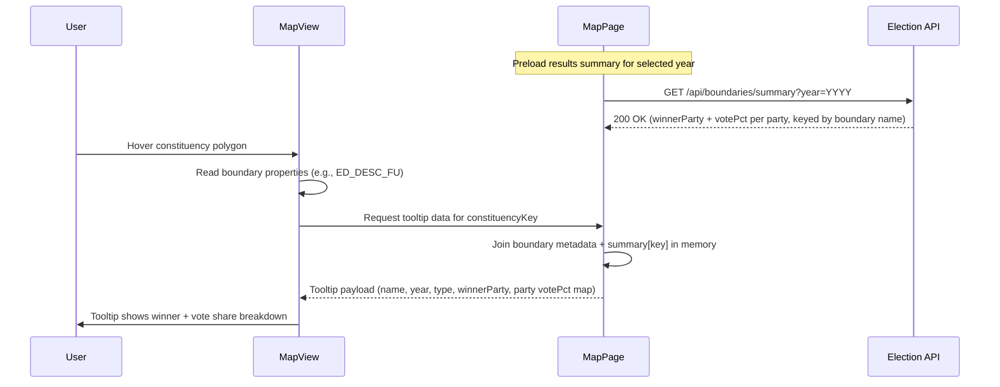

---

## 6. Filter Map Results

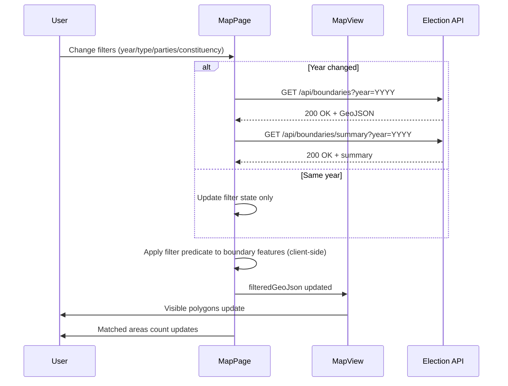

---

## 10. Collapse / Expand Map Filters Sidebar

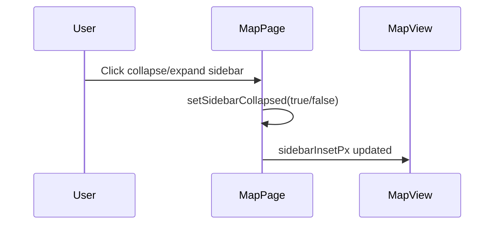

---

## 11. View Election Dashboard Search Table

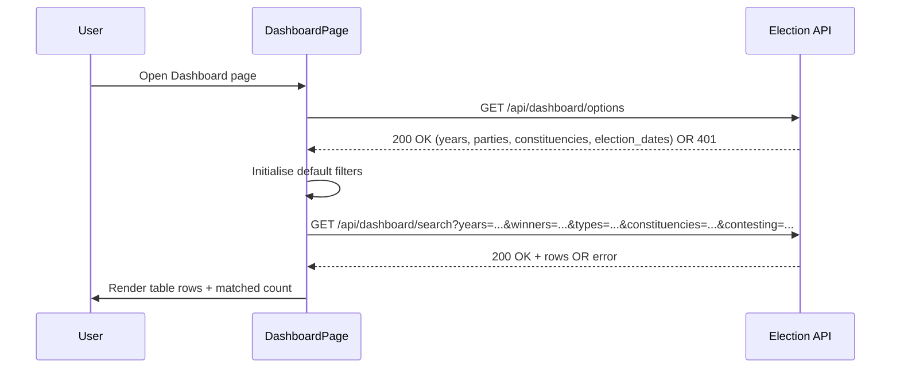

---

## 12. Filter Dashboard Search Results

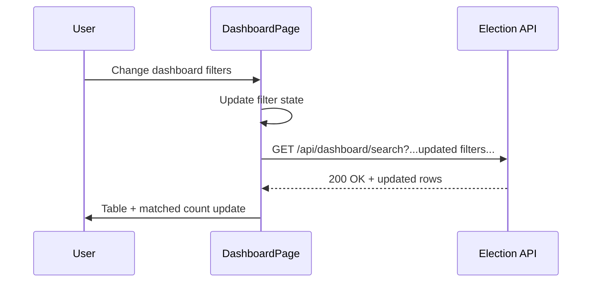

---

## 13. View Dashboard Search Result Details

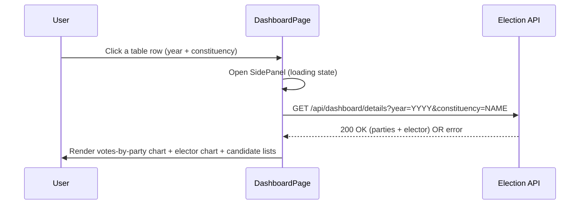

---

## 14. Reset Dashboard Search Filters

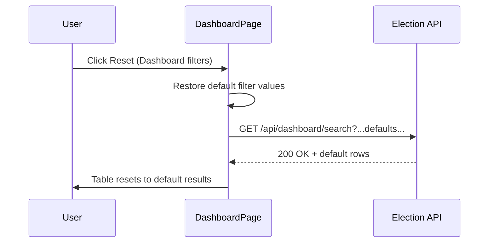

---

## 15. View Election Dashboard Summary

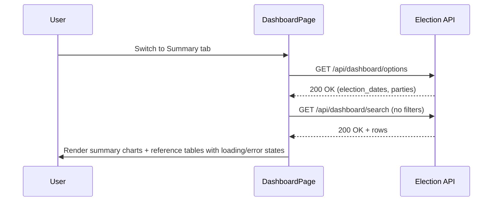

---
