# Test Procedures

Each test procedure corresponds to a user story (**1–15**) and validates its acceptance criteria.

---

## User Story Table

| No. | User Story                             | As a... | I want to...                                                                                                                                              | So that...                                                         |
| --- | -------------------------------------- | ------- | --------------------------------------------------------------------------------------------------------------------------------------------------------- | ------------------------------------------------------------------ |
| 1   | Sign In and Maintain Session           | user    | sign in securely and remain signed in across page refreshes                                                                                               | I can use the app without repeatedly logging in                    |
| 2   | Sign Out and End Session               | user    | sign out and have my session cleared/invalidated                                                                                                          | protected pages cannot be accessed until I sign in again           |
| 3   | Navigate Between Pages                 | user    | switch between **Dashboard** and **Map** from the top navigation                                                                                          | I can move quickly between analysis and geographic views           |
| 4   | View Electoral Boundaries on Map       | user    | view constituencies on an interactive map                                                                                                                 | boundaries can be explored visually                                |
| 5   | View Electoral Boundary Details on Map | user    | hover over a constituency to see key details (name, year, type, winner, vote share)                                                                       | constituency information can be understood without leaving the map |
| 6   | Filter Map Results                     | user    | filter the map by year, constituency type (SMC/GRC), contesting party, winner party, and/or constituency                                                  | the map shows only the areas I am analysing                        |
| 7   | Reset Map Filters                      | user    | reset all map filters back to defaults                                                                                                                    | I can return to an unfiltered view quickly                         |
| 8   | Automatic Map Focus                    | user    | have the map automatically focus on the selected constituency                                                                                             | the relevant area is visible without manual panning/zooming        |
| 9   | Toggle Simple Map Style                | user    | toggle between **Default** and **Simple** basemap styles                                                                                                  | a more readable map view can be chosen when needed                 |
| 10  | Collapse / Expand Map Filters Sidebar  | user    | collapse the filters sidebar into a compact rail and reopen it                                                                                            | more map space is available when needed                            |
| 11  | View Election Dashboard Search Table   | user    | view a searchable table of constituency results (year, constituency, type, contested, winner, margin)                                                     | I can browse and scan results efficiently                          |
| 12  | Filter Dashboard Search Results        | user    | filter the dashboard table by year, contesting party, winner party, constituency type, and constituency                                                   | the table matches what I am analysing                              |
| 13  | View Dashboard Search Result Details   | user    | select a row to open a side panel showing (1) votes-by-party chart, (2) registered vs rejected vs spoilt ballots chart, and (3) candidate lists per party | I can understand the selected constituency in detail               |
| 14  | Reset Dashboard Search Filters         | user    | reset all dashboard search filters back to defaults                                                                                                       | I can restart analysis quickly without manually clearing filters   |
| 15  | View Election Dashboard Summary        | user    | view overall summary visuals (constituencies won by party; year-by-year constituencies won) and reference tables (election dates; political parties)      | I can understand high-level trends and context across years        |

---

## Test for 1: Sign In and Maintain Session

**Objective:**
Verify that a user can sign in, receive a valid session, and remain signed in across page refreshes.

**Steps:**

1. Launch the Singapore Election App.
2. Confirm that the login form is displayed.
3. Leave username and/or password empty and click **Sign In**.
4. Enter valid credentials and click **Sign In**.
5. Confirm that user is redirected to Dashboard Page.
6. Refresh the browser page.

**Expected Results:**

* Missing or invalid fields show a clear validation error and no login request is completed.
* Valid credentials authenticate successfully and grant access to protected pages.
* After refresh, the session remains valid and the user stays signed in.

  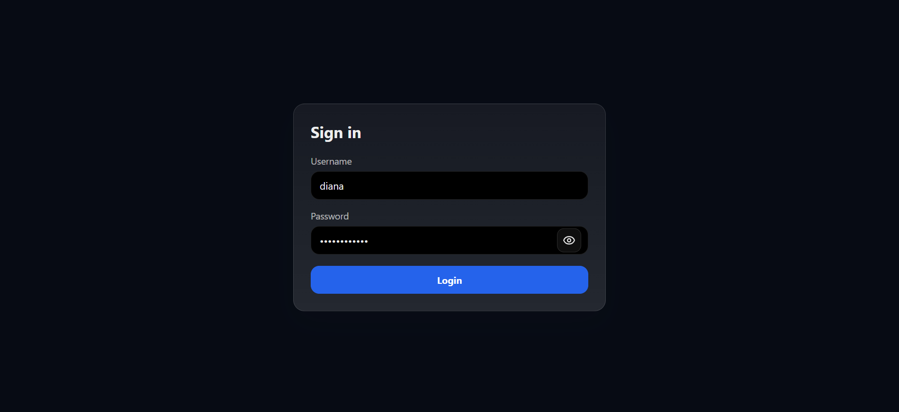
  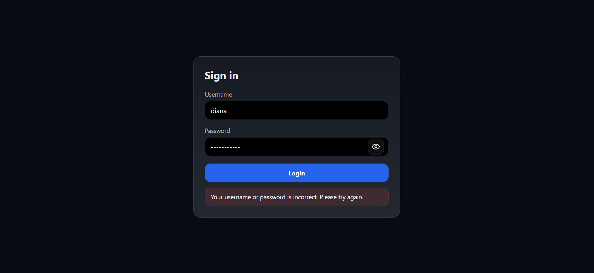

---

## Test for 2: Sign Out and End Session

**Objective:**
Verify that signing out clears/invalidates the session and blocks protected pages until sign-in.

**Steps:**

1. Sign in successfully (User Story 1).
2. Click *Sign out*.
3. Confirm user is redirected to the login page.
4. Attempt to open `/dashboard` directly via the browser URL bar.
5. Attempt to open `/map` directly via the browser URL bar.
6. Refresh the login page.

**Expected Results:**

* Logout clears client session state (token/cookie removed) and ends the session.
* Protected routes cannot be accessed after logout and redirect to login.
* Refresh does not restore access without signing in again.

  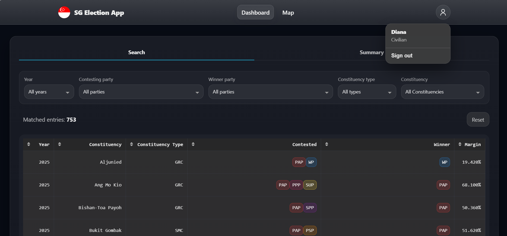

---

## Test for 3: Navigate Between Pages

**Objective:**
Verify navigation between **Dashboard** and **Map** using top navigation without full page reload.

**Steps:**

1. Sign in successfully.
2. Click **Dashboard** in the top navigation.
3. Click **Map** in the top navigation.
4. Repeat switching between the two pages several times.

**Expected Results:**

* Navigation changes the route/page without a full reload.
* The active navigation item is visually indicated.
* Access to both pages requires a valid session.

  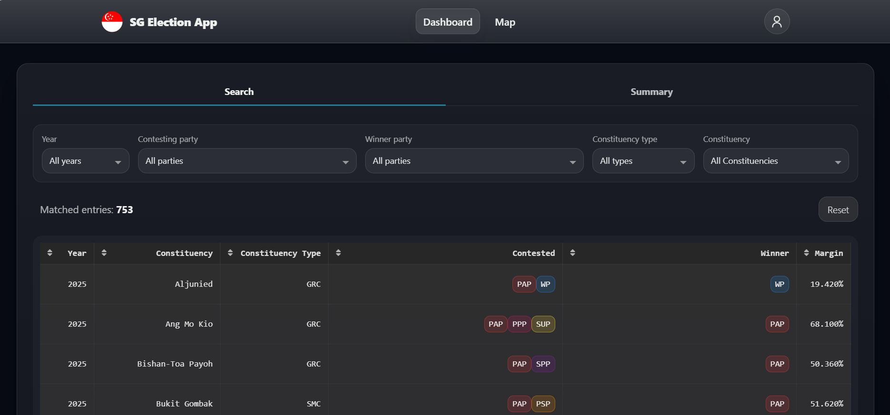
  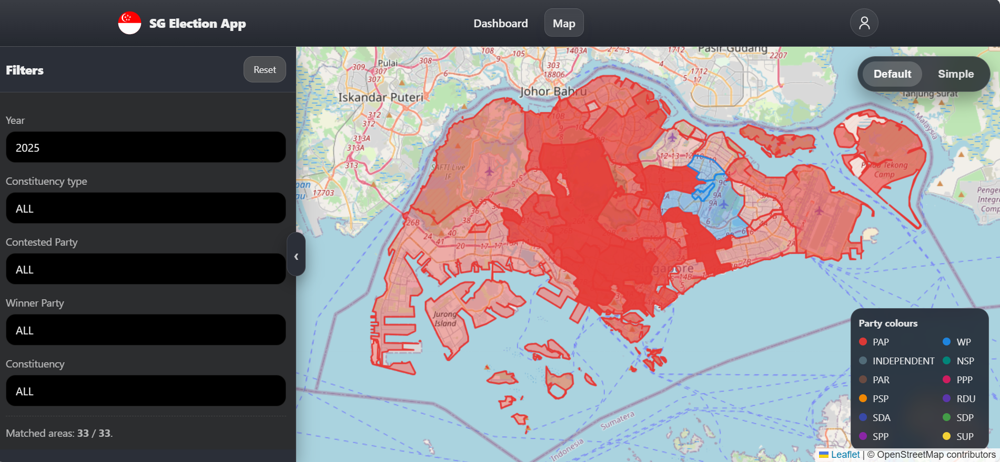

---

## Test for 4: View Electoral Boundaries on Map

**Objective:**
Verify constituency boundaries load and render correctly on the map for a selected year.

**Steps:**

1. Sign in and open the **Map** page.
2. Confirm the default filters are selected.
3. Observe whether boundaries render as polygon overlays.
4. Pan and zoom the map.

**Expected Results:**

* Boundaries load for the selected year and appear as polygons with visible borders.
* Standard map interactions (pan/zoom) work normally.
* A loading state is shown while boundaries fetch/render.

  

---

## Test for 5: View Electoral Boundary Details on Map

**Objective:**
Verify hover tooltip displays constituency details including winner and vote shares (where available).

**Steps:**

1. Ensure boundaries are visible on the Map page.
2. Hover over a constituency polygon.
3. Hover over a different constituency polygon.

**Expected Results:**

* Hovering shows a tooltip containing:

  * Constituency name
  * Election year
  * Constituency type (SMC/GRC)
  * Winner party
  * Vote share breakdown for contesting parties (when contested)
* Tooltip closes when cursor leaves the polygon (or via a close action if click-based).
* Displayed details match the selected year and applied filters.

  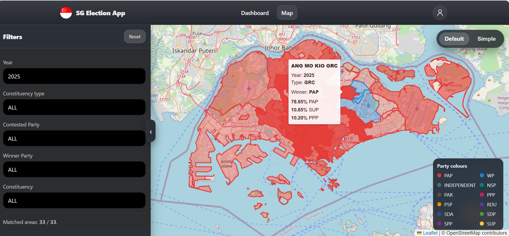

---

## Test for 6: Filter Map Results

**Objective:**
Verify map filters update visible constituencies and matched count correctly.

**Steps:**

1. Open the **Map** page.
2. Apply a **Year** filter and observe changes.
3. Apply **Constituency type (SMC/GRC)** filter and observe changes.
4. Apply **Contesting party** filter and observe changes.
5. Apply **Winner party** filter and observe changes.
6. Select a specific **Constituency** and observe changes.
7. Combine multiple filters (e.g., Year + Type + Winner party).
8. Apply filters that produce zero results.

**Expected Results:**

* Visible polygons update to reflect current filters.
* Filters are combinable and apply simultaneously.
* A matched count (e.g., “Matched areas: X / Y”) updates correctly.
* When no results match, an informative empty state is shown (without breaking the map).

  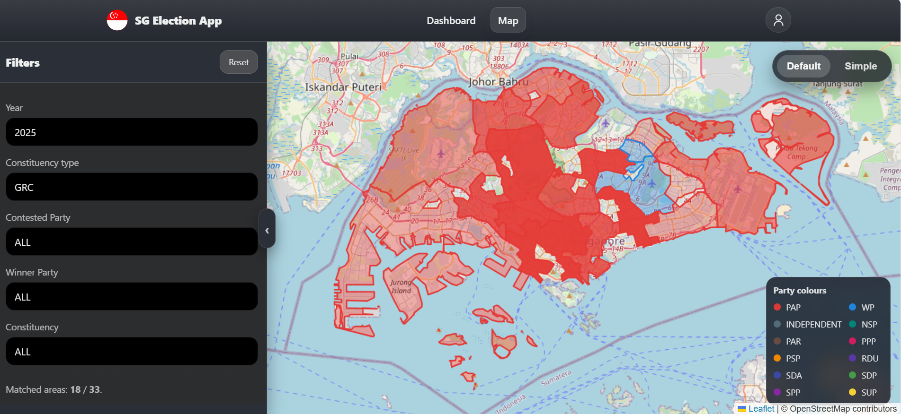
  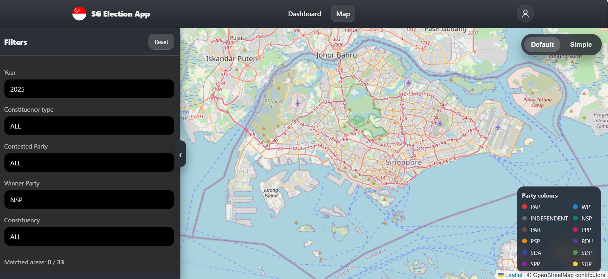

---

## Test for 7: Reset Map Filters

**Objective:**
Verify map filters reset to defaults and the full default scope returns.

**Steps:**

1. Apply multiple map filters (User Story 6).
2. Click **Reset** in the map filters panel.
3. Observe the map and matched count.

**Expected Results:**

* All filters return to default values.
* All constituencies for the default scope are shown again.
* Matched count updates immediately and correctly.

  

---

## Test for 8: Automatic Map Focus

**Objective:**
Verify the map focuses on the selected constituency and accounts for sidebar width.

**Steps:**

1. Ensure the map filters sidebar is expanded.
2. Select a specific constituency via dropdown/list (or click a polygon, if supported).
3. Observe the map viewport adjustment.
4. Collapse the sidebar to the compact rail.
5. Select another constituency and observe the map viewport adjustment again.
6. Clear selection (if supported) and confirm the map does not keep forcing focus changes.

**Expected Results:**

* The map zooms/pans to fit the selected constituency bounds with padding.
* With the sidebar expanded, the selected constituency is centred within the visible map area (not hidden under the sidebar).
* With the sidebar collapsed, focus behaves normally in full width.
* If geometry is unavailable, a clear error is shown and incorrect focusing is avoided.

  
  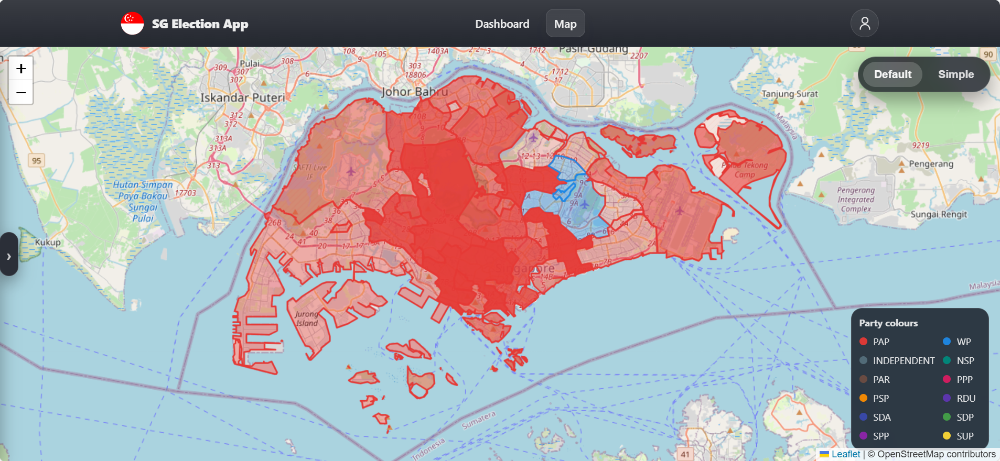

---

## Test for 9: Toggle Simple Map Style

**Objective:**
Verify basemap toggling changes tiles without clearing boundaries, filters, or selection.

**Steps:**

1. On the Map page, ensure boundaries are visible.
2. Toggle basemap to **Simple**.
3. Observe basemap tile style.
4. Toggle basemap back to **Default**.
5. Confirm boundaries remain visible and current filters persist.

**Expected Results:**

* Tile layer changes between Default and Simple.
* Boundaries and selection remain visible.
* Filters, year, and selection persist across toggles.
* If a basemap fails to load, the app falls back gracefully and shows an error.

  
  

---

## Test for 10: Collapse / Expand Map Filters Sidebar

**Objective:**
Verify sidebar collapse/expand works and does not break map rendering or focusing.

**Steps:**

1. On the Map page, expand the filters sidebar.
2. Click the collapse control.
3. Confirm the sidebar becomes a compact rail.
4. Reopen/expand the sidebar.
5. Toggle collapse/expand repeatedly while panning/zooming the map.
6. Select a constituency and verify auto-focus with sidebar expanded vs collapsed.

**Expected Results:**

* Sidebar collapses into a compact rail and expands back reliably.
* The map resizes correctly (no broken tiles, incorrect bounds, or blank areas).
* Auto-focus behaviour reflects sidebar state.

  
  

---

## Test for 11: View Election Dashboard Search Table

**Objective:**
Verify the dashboard search table renders, is searchable, and shows expected columns and counts.

**Steps:**

1. Sign in and open the **Dashboard** page.
2. Locate the search table section.
3. Confirm the table shows required columns (year, constituency, type, contested, winner, margin).
4. Use the search input (if provided) to search for a known constituency.
5. Clear search and confirm results return.

**Expected Results:**

* Table loads with the required columns and rows.
* Total matched entries count is displayed and updates based on search.
* If sorting is enabled (e.g., by year or constituency), it works correctly.

  

---

## Test for 12: Filter Dashboard Search Results

**Objective:**
Verify dashboard filters update the search table correctly.

**Steps:**

1. On the Dashboard page, apply a **Year** filter.
2. Apply **Constituency type (SMC/GRC)** filter.
3. Apply **Contesting party** filter.
4. Apply **Winner party** filter.
5. Apply a **Constituency** filter (select a specific constituency).
6. Combine filters (e.g., Year + Winner party).
7. Apply filters that result in zero matches.

**Expected Results:**

* Table rows update to reflect current filters.
* Filters are combinable and applied together.
* Matched entries count updates correctly.

  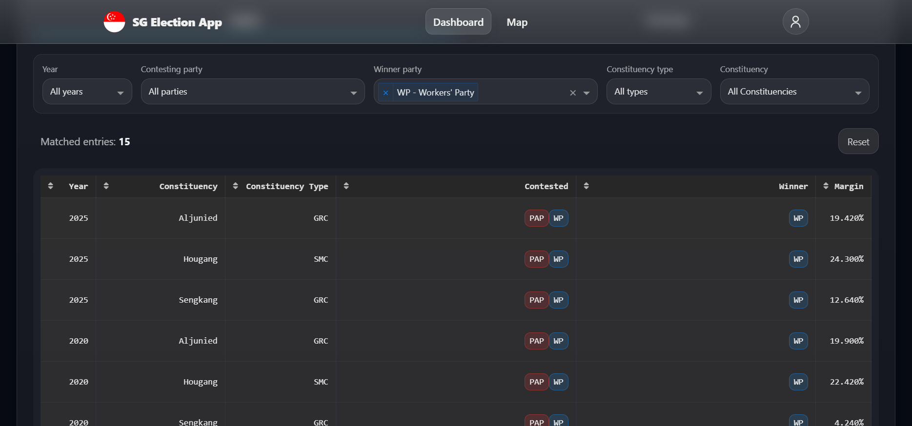

---

## Test for 13: View Dashboard Search Result Details

**Objective:**
Verify selecting a row opens a side panel with charts and candidate lists.

**Steps:**

1. On the Dashboard table, select a constituency row.
2. Confirm a side panel opens showing the selected constituency name and year.
3. Verify the side panel shows:

   * votes-by-party chart
   * registered vs rejected vs spoilt ballots chart
   * candidate lists grouped by party
4. Close the side panel using the provided close action.
5. Repeat with a constituency/year where some data is missing (e.g., walkover or missing electors stats), if available.

**Expected Results:**

* Selecting a row opens the side panel for that constituency/year.
* Charts render where data is available and match the selected constituency/year.
* When data is missing, the panel shows a clear fallback message rather than failing.
* Close action returns focus to the table view.

  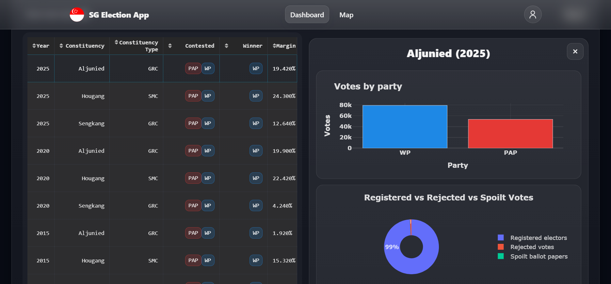
  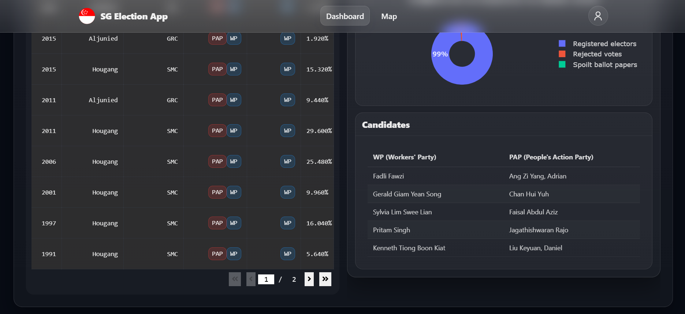

---

## Test for 14: Reset Dashboard Search Filters

**Objective:**
Verify dashboard filters reset to defaults and the table reloads to default scope.

**Steps:**

1. Apply multiple dashboard filters (User Story 12).
2. Click **Reset** for dashboard filters.
3. Observe filter controls, table rows, and matched count.
4. If a side panel is open, observe whether it closes or remains open (verify consistent behaviour).

**Expected Results:**

* Filters return to default values.
* Table reloads to default (unfiltered) results.
* Matched count updates immediately.
* Side panel behaviour is consistent (either always closes on reset, or always remains open with the same selection).

  

---

## Test for 15: View Election Dashboard Summary

**Objective:**
Verify summary visuals and reference tables load and remain usable even if one component fails.

**Steps:**

1. Open the **Dashboard** page and locate the summary section.
2. Verify overall visuals load:

   * constituencies won by party (overall)
   * year-by-year constituencies won (by party)
3. Verify reference tables load:

   * election dates (nomination day, polling day)
   * political parties (abbreviation, full name)

**Expected Results:**

* Summary charts render with correct labels and data.
* Reference tables render and are readable.
* Clear loading states appear while data is fetched.

  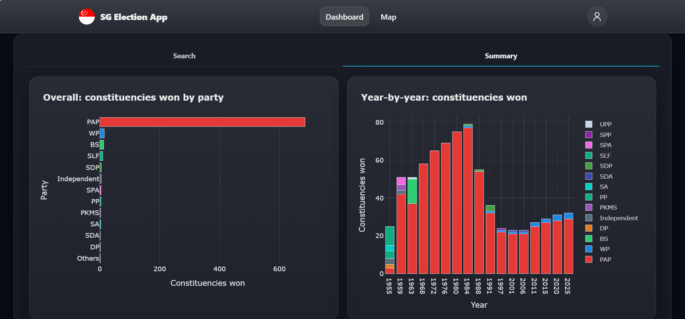
  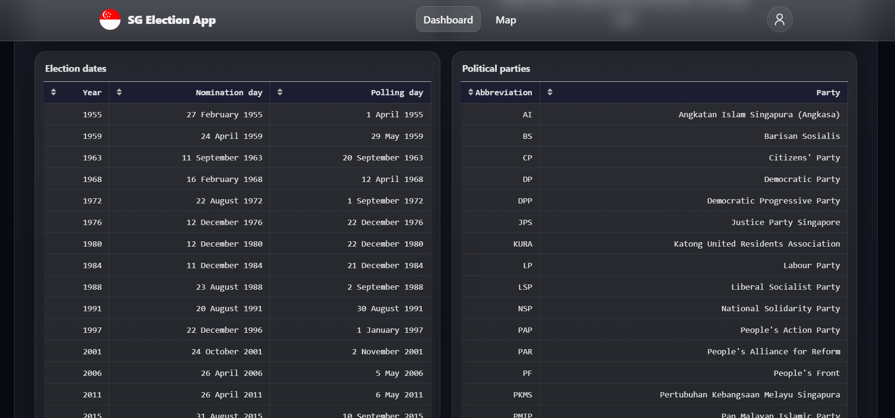

---
